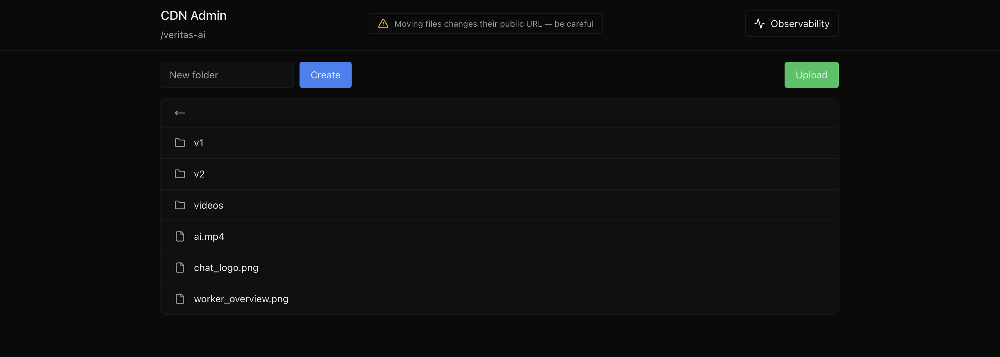

<p align="center">
  
</p>

<a href="https://adityabaindur.dev/r2">
  <h1 align="center">CDN Admin</h1>
</a>


<h1 align="center">
  <a href="https://adityabaindur.dev/r2">CDN Admin</a>
</h1>


<p align="center">
  
  
  
  
  
  
  
  
</p>

<p align="center">
  <a href="https://deploy.workers.cloudflare.com/?url=https://github.com/Aditya-Baindur/r2-list.git">
    
  </a>
</p>

---

## Why CDN Admin?

<p align="center">
  <a href="https://adityabaindur.dev/r2">
    
  </a>
</p>
<p align="center">
  Click on the image to visit the landing page
</p>

Cloudflare R2 is powerful, but day‑to‑day operations often require more than the CLI:

* Visual browsing of buckets & folders
* Fast file inspection and copyable URLs
* Object organization without leaving the browser
* Optional Cloudflare Access protection
* Telemetry via D1 for usage and observability

**CDN Admin** is a production‑style dashboard you can deploy in under 2 minutes.

---

## Features

* Hierarchical folder & file browser (R2 native listing)
* Rename, move, delete, and organize objects with instant edge execution
* One-click public URL copy with clipboard integration
* D1-backed telemetry (downloads, size, activity)
* Optional Cloudflare Access protection
* Zero backend — runs entirely on Workers + R2 + D1 at the edge

---

## Architecture

* **Frontend**: Static HTML + Tailwind + Lucide icons (served from R2)
* **Backend**: Cloudflare Worker API (no traditional server)
* **Storage**: Cloudflare R2
* **Telemetry**: Cloudflare D1
* **Security (optional)**: Cloudflare Access

<p align="center">
  <a href="https://adityabaindur.dev/r2">
    
  </a>
</p>

---

## Quick Deploy (Recommended)

This deploy flow automatically provisions everything you need.

<p align="center">
  <a href="https://deploy.workers.cloudflare.com/?url=https://github.com/Aditya-Baindur/r2-list.git">
    
  </a>
</p>

Creates:

This deploy flow automatically provisions:

* R2 bucket (or connect an existing one)
* D1 telemetry database
* Worker bindings
* Production deployment on Cloudflare Workers

> Requires an active **Cloudflare R2 subscription**. If you don't have one, the Cloudflare UI will guide you.

Developer tools for local development can be access at [docs/DevTools.md](./docs/DevTools.md)

---

## Environment Variables

| Variable    | Purpose                                                   |
| ----------- | --------------------------------------------------------- |
| AUTH_STATUS | `dev` disables Access auth checks (prod enables access) |

Default Example:

```env
AUTH_STATUS=dev
```

Recommended leaving to default for first build

---

## Security Model

By default the dashboard is publicly accessible, making it suitable for open CDN management workflows.

To enable authentication, follow **[Access.md](./docs/Access.md)**.

---

## Roadmap

* File and Folder level access rules
* Audit logs & activity timeline
* Multi‑bucket support
* Search & filtering

---

## License

MIT — free to use, modify, and self‑host.

---

Built with ❤️ on Cloudflare Workers by Aditya Baindur
